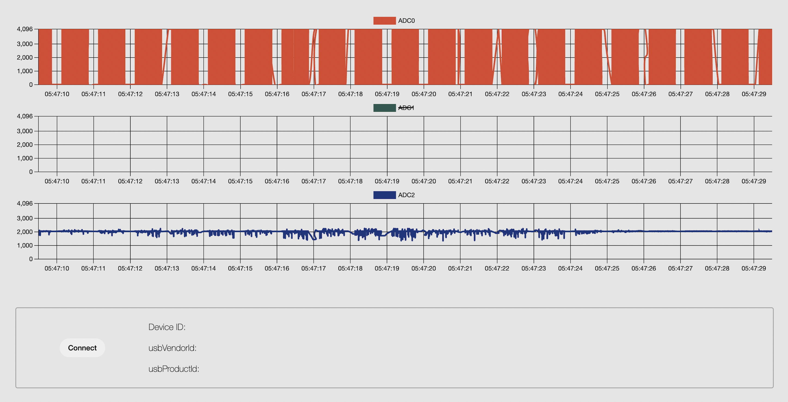

# **Picometer**


## **About**
Raspberry Pi Pico based analog input monitoring dashboard built with ExpressJS.

## **Setup**

### Pico UF2 setup
No need to build from source - you can use the provided UF2 image in `/pico` directory.

### Dashboard Setup

- Install required libraries;
```javascript
npm install
```

- Start the dev server;
```javascript
npm run dev
```